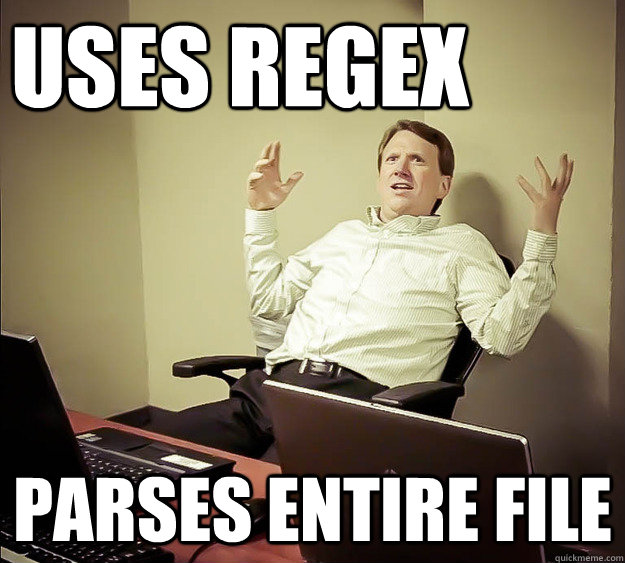

# Intro to Regex

The regex talk will be interactive.  These preparation instructions will ensure you get the most out of the meeting.

## Assumptions

 This talk will assume you will:
 
1. Forked or cloned this repo and pulled down locally ([git is an excellent way to do this](http://stackoverflow.com/questions/1872113/how-do-i-clone-a-github-project-to-run-locally))   
2. Have Python or R installed    
3. Have Jupyter notebooks or RStudio up and running    
4. Have required add-on modules/packages installed    
5. Have familiarity with either pandas and its `DataFrame` or base R and its `data.frame`    

## Preparation

Choose R or Python to use in the talk & ...    

**R:**    

1. Install:
	a. [R v. >= 3.0.0](https://cran.rstudio.com/)    
	b. [RStudio v. >= 0.99.1251](https://www.rstudio.com/products/rstudio/download3/)     
	c. stringi package (`install.packages('stringi')`)         
2. Be able to run RStudio     
  
**Python** 

1. Install:
    a. Python v. >= 3.0    
    b. numpy module     
    c. [pandas v. >= 18.1](http://pandas.pydata.org/pandas-docs/stable/install.html) module         
2. Be able to [run Jupyter notebooks](https://www.youtube.com/watch?v=k_fJJ7Ak33c)     
 

## Contents

- [Slides](slides/regex_talk.pdf)
- Exercises    
      - R      
        - Exercise 1: Regex Actions     
            - Exercise: [01_regex_actions.Rmd](exercises/R/01_regex_actions.Rmd)     
            - Answer Key: [01_regex_actions_answers.Rmd](exercises/R/01_regex_actions_answers.Rmd)     
        - Exercise 2: Regex Basics      
            - Exercise: [02_regex_basics.Rmd](exercises/R/02_regex_basics.Rmd)     
            - Answer Key: [02_regex_basics_answers.Rmd](exercises/R/02_regex_basics_answers.Rmd)        
      - Python     
        - Exercise 1: Regex Actions        
            - Exercise: [01_regex_actions.ipynb](exercises/Python/01_regex_actions.ipynb)     
            - Answer Key: [01_regex_actions_answers.ipynb](exercises/Python/01_regex_actions_answers.ipynb)    
        - Exercise 2: Regex Basics     
            - Exercise: [02_regex_basics.ipynb](exercises/Python/02_regex_basics.ipynb)     
            - Answer Key: [02_regex_basics_answers.ipynb](exercises/Python/02_regex_basics_answers.ipynb)     
        
        
        
        
        
        